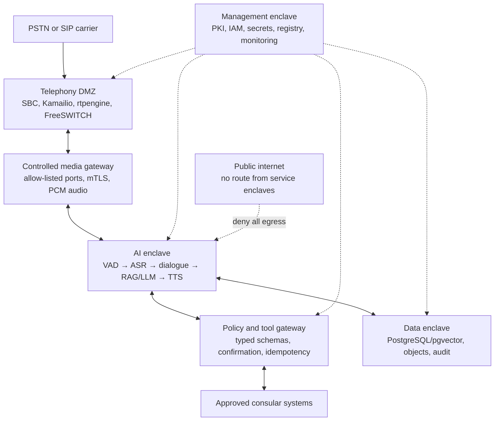
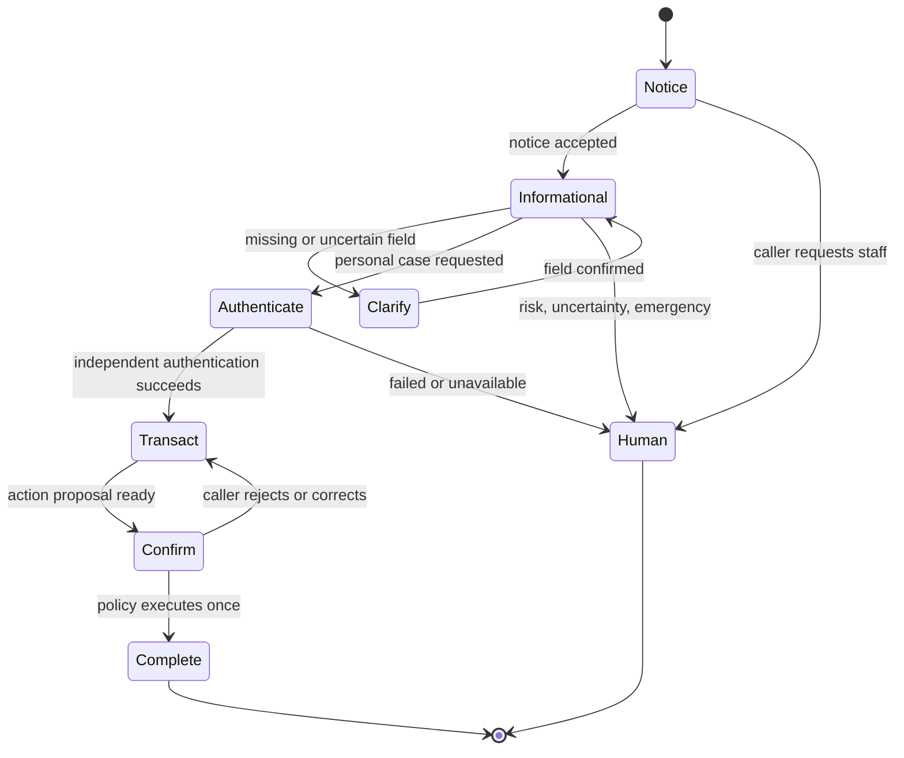

# Isolated Turkish Consular Call-Center Agent

## End-to-end reference architecture, open-model landscape, security controls, and validation plan

**Research date:** 11 August 2026  
**Revision:** 3 — expanded engineering, accreditation, and scientific-evidence dossier  
**Intended environment:** A foreign diplomatic/consular mission serving Turkish-speaking callers  
**Design objective:** Live telephone service with no cloud inference, no external telemetry, and no outbound data path from the AI environment

> This is a technical and risk-management design, not a legal opinion. The receiving state, sending state, mission status, carrier arrangements, and the exact consular services offered can change the legal analysis. Local and sending-state counsel should approve the data map, call notice, lawful basis, retention schedule, voice consent, and automated-service boundaries before launch.

## 1. Executive conclusion

The system is feasible with current locally deployable models. The safest first production release is an **information-and-routing agent**, not an autonomous visa or consular decision-maker. It should answer from an approved, versioned knowledge base; handle routine call routing and appointment guidance; collect only necessary fields; and transfer uncertain, sensitive, emergency, discretionary, or authenticated cases to a human.

The recommended model bake-off is:

- **Speech recognition:** Qwen3-ASR 1.7B/0.6B as the Apache-2.0 production candidate; NVIDIA Nemotron 3.5 ASR Streaming 0.6B as the strongest native-streaming challenger subject to legal approval of its OpenMDW license; Whisper large-v3/turbo as the mature regression baseline. Microsoft VibeVoice-ASR should be tested for after-call diarization and code-switching, not assumed to be the live engine.
- **Speech synthesis:** FreyaTTS-small as the first Turkish house-voice candidate: it is compact, Apache-2.0, Turkish-first, and evaluated through an 8 kHz-matched protocol, but it is a fixed single voice rather than zero-shot cloning. MOSS-TTS-Realtime 1.7B and VoxCPM2 remain the principal Apache-2.0 runtime-cloning candidates; Chatterbox Multilingual is the smaller watermarked challenger. Trendyol-TTS remains behind a private-data provenance gate.
- **Language model:** Qwen3.5-35B-A3B as the likely low-latency primary candidate; gpt-oss-120b as the Turkish-quality reference; Mistral Small 3.1 24B as a vendor-diverse fallback; and Trendyol-LLM-8B-T1 as the Turkish-small-model challenger. BİLGE is strategically interesting but was not publicly downloadable at the research date.
- **Retrieval:** Qwen3-Embedding 0.6B or 4B plus its reranker, compared against BGE-M3, over PostgreSQL full-text search and pgvector.

Do not select a winner from public leaderboards alone. None of the public results adequately reproduces an 8 kHz Turkish consular call with accents, code-switching, packet loss, personal names, passport identifiers, dates, acronyms, and legal terminology. A controlled Turkish telephony benchmark is a launch gate.

The correct isolation claim is **zero-egress isolated enclave**, not an absolute air gap. A live call necessarily crosses the boundary through the PSTN/SIP carrier. The media boundary is therefore a tightly controlled cross-domain interface; the AI, data, management, and model-serving networks have no internet route, public DNS, cloud API, package registry, or vendor telemetry.

## 2. Recommended scope for release 1

### In scope

- Opening hours, location, accessibility, public holidays, jurisdiction, and contact channels.
- Document checklists, published fees, appointment rules, and official process explanations.
- Intent recognition, language selection, queue routing, and human handoff.
- Appointment lookup or booking only through a typed, allow-listed service with separate caller authentication, explicit read-back, and confirmation.
- After-call structured summary for the human queue, with sensitive fields redacted and a link to the approved source passages used.

### Out of scope until separately authorized and validated

- Visa, nationality, asylum, emergency-protection, or eligibility decisions.
- Legal advice or interpretation beyond an approved published text.
- Voice biometric authentication or caller identity inferred from speech.
- Financial transactions or collection of payment-card data by the model.
- Free-form model access to consular databases, email, file shares, or the internet.
- Cloning an ambassador, public official, or caller's voice.
- Reusing production calls for training without a distinct purpose, lawful basis, notice/consent where required, and a separated research environment.

For any unavailable or uncertain answer, the correct behavior is to say that the information cannot be verified from the approved sources and offer a human transfer. The agent must never improvise a consular rule.

## 3. Reference architecture



### Zone responsibilities

| Zone | Components | Permitted traffic | Prohibited traffic |
|---|---|---|---|
| Carrier edge / telephony DMZ | Redundant SBC/firewalls, Kamailio, rtpengine, FreeSWITCH, DTMF suppression | Carrier SIP/RTP; narrow media/control path to the gateway | Direct access to models, databases, secrets, or management APIs |
| AI enclave | Audio front end, streaming ASR, turn manager, RAG, LLM, TTS | mTLS service calls to data and policy gateways | Internet, public DNS, cloud APIs, arbitrary database access |
| Policy/tool enclave | Open Policy Agent, typed adapters, transaction state machines | Named service identities to named consular endpoints | Model-generated SQL, shell, URLs, or untyped API calls |
| Data enclave | PostgreSQL/pgvector, encrypted object storage, append-only audit, backups | Authorized application and administrative identities | Direct DMZ or caller access; outbound replication |
| Management enclave | Internal PKI/DNS/NTP, Keycloak, OpenBao/HSM, signed registry, monitoring | Administrative access from managed workstations | General user browsing; runtime package/model downloads |
| Import quarantine | Dual-controlled staging host, malware scanning, SBOM/license verification, signing | Deliberate import of approved artifacts | Direct route into production; automatic synchronization |

[NIST SP 800-207](https://www.nist.gov/publications/zero-trust-architecture-0) is a useful baseline: network location alone must not grant trust. Every service gets an identity, mTLS, a minimal policy, and a short-lived credential. [NIST AI RMF and its Generative AI Profile](https://www.nist.gov/publications/artificial-intelligence-risk-management-framework-generative-artificial-intelligence) provide the lifecycle governance frame; [NIST SP 800-218 SSDF](https://csrc.nist.gov/pubs/sp/800/218/final) provides the software and model supply-chain discipline.

### Live call path

1. The SBC validates the trunk, rate-limits signaling, blocks unexpected codecs, and terminates external SIP. Media is anchored in the DMZ; carrier RTP never reaches a GPU node.
2. FreeSWITCH keeps caller and agent audio as separate channels. It removes DTMF tones before recording/transcription and exposes only normalized audio frames to the controlled gateway.
3. The audio service applies jitter buffering, resampling, echo handling, and voice-activity detection. Barge-in immediately stops synthesis and clears queued audio.
4. Streaming ASR emits partial and final Turkish text plus timestamps and confidence. A deterministic normalizer handles dates, amounts, spelled letters, passport identifiers, and Turkish number forms.
5. A dialogue state machine owns consent state, authentication state, allowed intents, required fields, retries, and handoff rules. The LLM does not own these controls.
6. Retrieval filters approved documents by jurisdiction, language, channel, and effective date before hybrid lexical/vector search and reranking.
7. The LLM receives the minimum necessary conversation window and retrieved passages. It must answer in a structured schema containing answer text, citations, confidence/abstention, next state, and at most a proposed tool call.
8. The policy gateway independently checks identity, purpose, caller authentication, field schema, consent, rate, confirmation, and idempotency. It—not the LLM—executes an allowed action.
9. TTS generates the approved synthetic voice locally. The caller can interrupt it. The system records model, prompt, policy, document, and tool versions in the audit trail, but never stores hidden chain-of-thought.
10. On failure, ambiguity, high risk, or infrastructure degradation, the PBX transfers to a human. Transactional functions fail closed; basic telephony fails over to the staffed queue.

## 4. State-of-the-art Turkish speech recognition survey

| Candidate | Turkish and streaming status | License | Strengths | Decision |
|---|---|---|---|---|
| [Qwen3-ASR 1.7B / 0.6B](https://huggingface.co/Qwen/Qwen3-ASR-1.7B) | Turkish is one of 30 supported languages; unified offline and streaming inference | Apache 2.0 | Strong current multilingual results, local weights, two sizes, deployable with local serving frameworks | **Primary bake-off; clean production license** |
| [NVIDIA Nemotron 3.5 ASR Streaming 0.6B](https://huggingface.co/nvidia/nemotron-3.5-asr-streaming-0.6b) | Turkish tr-TR is transcription-ready; native cache-aware streaming at selectable chunk sizes | OpenMDW 1.1 | Designed for high-concurrency low-latency streams; punctuation, capitalization, language detection; author reports Turkish FLEURS WER from 12.34% at 80 ms to 11.17% at 1.12 s with language specified | **Strong challenger; counsel must approve custom license** |
| [Whisper large-v3 / turbo](https://github.com/openai/whisper) | Multilingual; 30-second sliding-window design rather than native low-latency streaming | MIT | Mature ecosystem, robust baseline; turbo is an optimized large-v3 derivative | **Regression and fallback baseline** |
| [Microsoft VibeVoice-ASR](https://huggingface.co/microsoft/VibeVoice-ASR) | More than 50 languages, code-switching, hotwords, timestamps, diarization; up to 60-minute single-pass audio | MIT | Rich who/when/what output and domain hotwords | **After-call QA/analytics candidate; 9B and not the preferred live streaming path** |
| [Vosk Turkish small](https://alphacephei.com/vosk/models) | Offline Turkish model; CPU-friendly | Apache 2.0 | Approximately 35 MB and suitable for degraded/CPU operation | **Emergency/degraded fallback, not SOTA** |
| [Voxtral Mini 4B Realtime](https://huggingface.co/mistralai/Voxtral-Mini-4B-Realtime-2602) | Native streaming, but the official 13-language FLEURS table does not include Turkish | Apache 2.0 | Strong real-time architecture and selectable delay | **Do not deploy for Turkish without a validated adaptation; community Turkish LoRAs are research leads only** |
| [Meta MMS 1B](https://huggingface.co/facebook/mms-1b-all) | Turkish within a 1,000+ language family | CC-BY-NC 4.0 | Broad language coverage | **Research only; noncommercial restriction** |

Qwen reports better aggregate multilingual results than Whisper large-v3 on several public sets, while Nemotron reports very high streaming concurrency. These are vendor/model-author results and are not Turkish consular telephony results. Treat them as candidates, not acceptance evidence.

### ASR evaluation corpus

Build a consented and anonymized set of at least 1,000–3,000 utterances, split by speaker so no speaker appears in both tuning and test sets. Include:

- 8 kHz G.711 A-law/µ-law and transcoded samples, packet loss, jitter, clipping, background voices, street noise, and echo.
- Istanbul and regional accents, older callers, soft speech, rapid speech, code-switching with the sending-state language and English.
- Turkish personal names, foreign names, addresses, dates, amounts, phone numbers, appointment codes, passport-style alphanumerics, acronyms, and form names.
- Questions that are acoustically similar but legally different.
- Silence, hold music, DTMF, cross-talk, and adversarial spoken prompt injection.

Measure word and character error rate, but make **entity error rate** for names, dates, identifiers, and amounts the principal business metric. Also measure p50/p95 partial latency, endpoint latency, real-time factor, partial-hypothesis instability, false endpoints, missed speech, and performance by subgroup/acoustic condition. Do not tune on the final test set.

## 5. Turkish TTS and voice-cloning survey

| Candidate | Turkish / cloning | License | Strengths | Decision |
|---|---|---|---|---|
| [FreyaTTS-small](https://huggingface.co/freyavoice/Freya-TTS) | Turkish-first, single consented voice written into the weights; **not** reference-audio cloning at runtime | Apache 2.0 | 183.2M parameters; released weights, inference code, and training pipeline. Its technical report uses 495 Turkish sentences, 8 kHz band-matching, 24 native raters, and reports WER 8.0%, CER 3.0%, MOS 3.68 ± 0.22 and RTX 4090 RTF about 0.10–0.11 | **Primary house-voice bake-off; particularly attractive for a controlled diplomatic identity** |
| [MOSS-TTS-Realtime 1.7B](https://huggingface.co/OpenMOSS-Team/MOSS-TTS) | Turkish among 20 languages; zero-shot cloning and multi-turn context | Apache 2.0 | Explicit voice-agent streaming variant; author reports about 180 ms TTS time-to-first-audio | **Primary bake-off** |
| [VoxCPM2](https://huggingface.co/openbmb/VoxCPM2) | Turkish among 30 languages; zero-shot and controllable cloning | Apache 2.0 | 48 kHz output, streaming, approximately 2B parameters and 8 GB claimed VRAM; author reports Turkish WER 0.82% and speaker similarity 87.1 on MiniMax-MLS-Test, plus RTF about 0.30 on RTX 4090 | **Primary bake-off; strongest published Turkish-specific evidence found, but author-run** |
| [Chatterbox Multilingual](https://github.com/resemble-ai/chatterbox) | Turkish among 23 languages; zero-shot cloning | MIT | Smaller 500M model; every generated sample receives the project's PerTh watermark | **Lightweight/watermarked challenger** |
| [Trendyol-TTS](https://huggingface.co/Trendyol/Trendyol-TTS) | Turkish-specific VoxCPM2 LoRA merged into a 2B checkpoint | MIT metadata, with upstream/data caveat | More than 20 hours of private Turkish speech; Turkish-specific pronunciation potential | **Lab challenger only until dataset rights, formal MOS, semantic regression, and load tests are cleared** |
| [dots.tts-mf](https://huggingface.co/dots-studio/dots.tts-mf) | Multilingual zero-shot cloning; model card explicitly reports a higher-WER gap for Turkish | Apache 2.0 | 2B few-step model designed for low latency | **Research challenger, not a Turkish front-runner** |
| [OmniVoice](https://huggingface.co/k2-fsa/OmniVoice) | Turkish within 600+ languages; voice cloning and design | Code Apache 2.0; weights CC-BY-NC | Compact 0.6B and author-reported very fast inference | **Exclude from production because the weights are noncommercial** |
| [XTTS-v2](https://huggingface.co/coqui/XTTS-v2) | Turkish and short-reference cloning | Coqui Public Model License | Popular and mature | **Exclude from production: license restricts model and output to noncommercial use** |
| [Higgs Audio / TTS 3](https://huggingface.co/bosonai/higgs-tts-3-4b) | Turkish in broad multilingual support; zero-shot cloning | Boson research/noncommercial terms | Expressive long-form generation | **Exclude unless a separate production license is procured** |

Author-reported speed is useful for screening but must be reproduced on the exact offline GPU, quantization, Turkish text, and concurrent call load. FreyaTTS has the most deployment-shaped Turkish evaluation found, but it is still an author-run preprint using an internal training corpus and a single voice; it is not independent acceptance evidence. The final choice must come from blind listening by native Turkish speakers and objective failure testing on the mission corpus.

### Safe voice policy

- Prefer a designed, non-identifiable **consular house voice**. A consented fixed/voice-locked model is safer than letting runtime workers clone arbitrary reference audio. If a human reference is used, obtain written, purpose-specific authorization covering synthesis, allowed channels, duration, derivative embeddings or weight updates, revocation, and incident response.
- Do not clone an ambassador, consul, politician, celebrity, or caller. Never use live caller audio as a cloning reference.
- Keep the approved voice reference and speaker embedding in a separate encrypted vault with dual approval. TTS workers receive only a short-lived reference token.
- Disclose at the start of the call that the caller is speaking with AI and hearing a synthetic voice. Preserve a machine-detectable watermark/provenance mark where technically possible; do not strip Chatterbox's built-in watermark.
- Use DTMF/OTP or an existing authoritative identity service for authentication. A voice that sounds similar is not proof of identity, and deepfake detection must not be the sole control.

Measure Turkish listener MOS, intelligibility, pronunciation accuracy over a 500+ item domain lexicon, omissions/additions, number and identifier accuracy, time to first audio, real-time factor, barge-in stop latency, watermark survival after G.711 transmission, and stability across long calls. Speaker similarity is secondary to clarity and safety.

## 6. Turkish LLM survey and selection

[TurkBench](https://aclanthology.org/2026.sigturk-1.12/) is the most relevant recent broad Turkish benchmark found. It contains 8,151 samples across 21 tasks and six capability groups. In its published comparison, gpt-oss-120b led the tested open models at 78.6 average, followed by GLM-4.6 at 76.9 and DeepSeek-V3.1 at 75.2; Qwen3-Next-80B-Instruct scored 75.0. The benchmark is valuable but is biased toward written formal, academic, and news text and does not reproduce spoken consular dialogues. Qwen3.5 was released after that evaluation and was not tested.

No single Turkish benchmark is sufficient. The scientific evaluation should use a portfolio:

| Benchmark/paper | Coverage | What it contributes | Limitation for this project |
|---|---|---|---|
| [Cetvel, EACL 2026](https://aclanthology.org/2026.eacl-long.46/) | 23 tasks in seven categories; 33 open-weight models up to 70B | Turkish grammar correction, generation, translation, extractive QA, idioms, history, and cultural knowledge; peer-reviewed | Written benchmark; no consular tool use or speech errors. It also finds that Turkish-centric instruction tuning does not automatically beat strong multilingual models |
| [TurkBench, SIGTURK 2026](https://aclanthology.org/2026.sigturk-1.12/) | 8,151 samples, 21 tasks, six capability groups | Broad current model ranking and reproducible Turkish suite | Formal/written distribution; newer candidates may be absent |
| [TR-MMLU](https://arxiv.org/abs/2501.00593) | 6,200 native multiple-choice questions across 62 sections | Turkish education-domain knowledge and tokenizer analysis | Preprint; multiple choice does not measure grounded dialogue, abstention, or action safety |
| [TurkishMMLU](https://arxiv.org/abs/2407.12402) | 10,032 questions across nine subjects | Large native Turkish knowledge benchmark with many model baselines | Academic knowledge is not consular procedure accuracy |
| [TUMLU, ACL 2025](https://aclanthology.org/2025.acl-long.1112/) | 38,139 native questions across eight Turkic languages and 11 subjects; manually verified mini subset | Peer-reviewed cross-Turkic robustness and native, rather than translated, evaluation | Mostly school knowledge; only the mini subset and scripts are fully released |
| [Morphological compositional generalization, NAACL 2025](https://aclanthology.org/2025.naacl-long.59/) | Turkish/Finnish productivity and systematicity tests, including novel roots and up to seven morphemes | Shows that high general benchmark performance can mask sharp failures on complex Turkish morphology | Diagnostic probe, not a complete assistant benchmark |

| Candidate | License / footprint | Why test it | Caution |
|---|---|---|---|
| [Qwen3.5-35B-A3B](https://huggingface.co/Qwen/Qwen3.5-35B-A3B) | Apache 2.0; 35B total, 3B active MoE; long context | Likely best live-agent cost/latency candidate; multilingual and structured/tool use | No independent Turkish consular result yet; new release and long-context claims do not remove need for local tests |
| [gpt-oss-120b](https://huggingface.co/openai/gpt-oss-120b) | Apache 2.0; 117B total, about 5.1B active; officially targets one 80 GB GPU | Best TurkBench result among tested open models; strong reasoning, structured output, tool use | Higher memory/operational cost; benchmark/reference or premium tier unless live latency passes |
| [Mistral Small 3.1 24B](https://huggingface.co/mistralai/Mistral-Small-3.1-24B-Instruct-2503) | Apache 2.0; 24B dense | Explicit Turkish support, JSON/function calling, vendor diversity | Dense model may be slower per active parameter; benchmark Turkish grounding locally |
| [Trendyol-LLM-8B-T1](https://huggingface.co/Trendyol/Trendyol-LLM-8B-T1) | Apache 2.0; Qwen3-8B derivative; 32k context | Turkish-specialized small-model challenger, inexpensive to host | E-commerce specialization, limited public real-world testing, and not evaluated in TurkBench's headline table |
| [DeepSeek-V3.1](https://huggingface.co/deepseek-ai/DeepSeek-V3.1) | MIT; very large MoE | Strong TurkBench result and useful offline quality reference | Operational footprint is excessive for most consulates; not the live default |
| [BİLGE](https://bilge.gov.tr/) | Turkish-first 1B/9B/27B family; terms/weights not publicly available at research date | Sovereign Turkish development and call-center relevance | The official site says it is not yet open to general use; partnership watchlist, not a deployable OSS dependency |

Use low or disabled deliberative reasoning for routine live turns; use a larger/slower model offline for quality review if justified. Reasoning traces must not be stored or shown. Fine-tuning should come only after the RAG and policy system has a measured failure set; it is not the first fix for stale facts or missing documents.

### Consular LLM acceptance set

Create 500–1,000 adjudicated Turkish conversations covering top intents, ambiguous phrasing, missing data, conflicting documents, expired rules, code-switching, emotional callers, prompt injection, fabricated citations, and requests for prohibited decisions. Score:

- Grounded factual correctness and exact source/section/effective-date citation.
- Correct abstention when the answer is absent, conflicting, expired, or outside jurisdiction.
- Intent, slot, and escalation accuracy.
- Exact structured-output/schema compliance.
- Tool name and parameter correctness before policy enforcement.
- Unsafe-action rate, sensitive-data leakage, and policy refusal quality.
- p50/p95 first-token and complete-turn latency under target concurrency.

The deployment gate is not a generic benchmark score. It is zero unconfirmed high-impact actions, reliable abstention, and an agreed error budget on the mission's own test set.

## 7. Knowledge base, retrieval, and data management

### Recommended retrieval stack

- PostgreSQL as the system of record, with [pgvector](https://github.com/pgvector/pgvector) for exact/approximate vector search and PostgreSQL `tsvector` for Turkish-aware lexical search.
- Reciprocal-rank fusion of lexical and dense results, followed by a small reranker.
- [Qwen3-Embedding](https://qwenlm.github.io/blog/qwen3-embedding/) 0.6B or 4B plus the corresponding reranker as the primary candidate; BGE-M3 as the challenger. Qwen reports 100+ language support. Use the independent [TR-MTEB Turkish embedding benchmark](https://aclanthology.org/2025.findings-emnlp.471/) for orientation, then evaluate a mission-specific retrieval set.
- No internet search at runtime. Every answerable fact must exist in an approved snapshot.

### Document lifecycle

1. Import only from named authoritative owners: foreign ministry, immigration/visa authority, consulate, approved treaty/law source, and signed local operating instructions.
2. Quarantine files. Disable macros and active content; scan malware; render or extract using reviewed offline tools; run Turkish OCR only where necessary; retain the immutable source.
3. Record owner, jurisdiction, language, document type, publication/effective/expiry dates, superseded document, approval status, checksum, source locator, and classification.
4. Chunk on semantic sections—headings, articles, checklist items, form instructions—not arbitrary token windows. Retain page/section spans.
5. Require two-person publish approval, sign the snapshot, and support atomic rollback. Expired and draft records must be retrieval-ineligible by default.
6. Re-embed only approved changed chunks; index versions are immutable and auditable.
7. Test retrieval before publish with known-answer, conflicting-version, and stale-document queries.

Retrieved text is **untrusted data**, even when it came from an official PDF. The orchestration prompt must tell the model to extract facts only and ignore instructions embedded in documents. Documents never grant tool permissions.

### Minimal logical schema

| Entity | Important fields | Retention principle |
|---|---|---|
| `call_session` | Pseudonymous ID, timestamps, notice/consent state, language, intent, model/prompt/policy versions, transfer reason | Keep only as long as operational/legal purpose requires |
| `transcript_segment` | Session ID, caller/agent leg, start/end, confidence, raw/enhanced text, PII class, retention tier | Redact before persistence; raw may be ephemeral |
| `knowledge_document` | Authority, jurisdiction, language, version, effective/expiry dates, status, checksum, approvers | Preserve according to records schedule |
| `knowledge_chunk` | Document/version, section span, text, embedding version | Reproducible from approved source |
| `action_event` | Proposed/confirmed/executed states, typed parameters, idempotency key, result code/hash | Audit-critical; encrypt sensitive fields |
| `audit_event` | Actor/service identity, timestamp, event type, object/version hashes, previous-event hash | Append-only, access-separated, tamper-evident |

### Privacy-by-design defaults

- Raw audio is ephemeral unless a documented purpose and retention schedule requires recording. When recording is required, separate it from routine analytics and encrypt it with a distinct key.
- Redact passport/identity numbers, birth dates, addresses, health details, payment data, and free-text secrets before storing transcripts or sending them to monitoring.
- Never put PII in metric labels, traces, exception messages, filenames, or model-cache keys.
- Apply full-disk encryption and mTLS, plus field-level envelope encryption for identifiers. Hold master keys in an HSM or equivalent protected key service; separate security administration from data administration.
- Backups are encrypted, immutable, periodically restore-tested, and never replicated outside the approved location.
- Production calls do not become a training corpus by default. A separate, consented/adjudicated dataset lives in a separate research enclave with its own access and deletion process.
- Do not collect or retain hidden chain-of-thought. Store only the final structured answer, cited sources, decisions, and action record necessary for audit.

## 8. Telephony and platform components

| Layer | Recommended open component | Purpose |
|---|---|---|
| SIP signaling | [Kamailio](https://www.kamailio.org/w/) | Redundant SIP proxy/routing, topology hiding, rate controls |
| Media anchoring | [rtpengine](https://github.com/sipwise/rtpengine) | RTP/SRTP relay and controlled media boundary |
| PBX/media application | [FreeSWITCH](https://www.signalwire.com/developers/freeswitch) | IVR, queues, recording controls, DTMF, codec handling, human transfer |
| Model serving | vLLM/SGLang for LLM; model-native local servers for ASR/TTS | Local batching, quantization, resource isolation |
| Identity | [Keycloak](https://www.keycloak.org/) | Staff/service identities, MFA, roles |
| Policy | [Open Policy Agent](https://www.openpolicyagent.org/docs/latest/) | Central, testable authorization and action policy |
| Secrets/PKI | [OpenBao](https://openbao.org/) plus HSM | Short-lived credentials, encryption keys, internal certificates |
| Data | PostgreSQL + pgvector + encrypted local object storage | Transactions, knowledge, audit, approved audio artifacts |
| Observability | Prometheus/Grafana/Loki or equivalent, with redaction | Capacity, latency, failures, security—not caller text by default |
| Artifact distribution | Offline OCI/model/package registry with signed immutable artifacts | No runtime downloads or external registries |

Pin the operating system, driver, CUDA/ROCm stack, Python wheels, model revision, tokenizer, quantization, prompts, policies, containers, and configuration by cryptographic digest. Disable every model hub's telemetry and auto-download function; production DNS cannot resolve public names anyway.

## 9. Isolation and security control set

### Network and identity

- Default-deny firewalls between every zone. Use explicit source identity, destination identity, port, protocol, and purpose for each rule.
- No NAT gateway or proxy from service enclaves. Internal-only DNS, NTP, PKI, identity, package/model registry, and update status service.
- Dedicated administration workstations, MFA, just-in-time privileged access, recorded administrative sessions, and dual control for key/model/knowledge publication.
- Service identities with mTLS and short-lived credentials. Rotate automatically inside the enclave.
- Separate caller media, operational control, data, management, backup, and security-monitoring networks.

### Model and software supply chain

1. Retrieve artifacts on a designated acquisition network.
2. Verify publisher, repository revision, hashes/signatures, license, and redistribution obligations. Produce an SBOM and a model inventory entry.
3. Scan containers, binaries, archives, and documents. Review custom inference code. Avoid pickle and `trust_remote_code`; when unavoidable, vendor and code-review the exact revision.
4. Convert to a safe serialization format where possible, reproduce load/inference in quarantine, and run malicious-model and unexpected-network tests.
5. Sign the approved bundle and import it through dual control. Production accepts only locally signed artifacts.
6. Maintain scheduled and emergency security-update paths without connecting production to the internet.

### Application threats and controls

| Threat | Required control |
|---|---|
| Spoken prompt injection | Treat speech as caller data; system/policy instructions are immutable; no caller text can create permissions |
| Document prompt injection / poisoning | Approved signed sources only; content is untrusted; two-person publishing; retrieval and action policies separated |
| Tool abuse | Typed allow-list; least-privilege adapter; independent OPA decision; caller authentication; read-back; explicit confirmation; idempotency |
| Data exfiltration through spoken answer | Response DLP and allowed-content policy; no arbitrary database fields in LLM context; output length/rate controls |
| Voice cloning abuse | Approved house voice, sealed reference, no caller cloning, disclosure, watermark/provenance, access audit |
| SIP/RTP attack or toll fraud | SBC termination, topology hiding, codec/number allow-list, rate and spend limits, patched PBX, media anchoring |
| Model denial of service | Per-call token/audio budgets, queue limits, admission control, circuit breakers, N+1 capacity, human fallback |
| Insider misuse | Separation of duties, purpose-based access, immutable audit, dual control, periodic access review |
| Hallucinated rule or stale guidance | Date/jurisdiction-filtered RAG, citations, abstention, approved snapshot, human escalation |

Red-team voice, text, documents, APIs, and SIP together. Test multi-turn jailbreaks, indirect document instructions, caller impersonation, replayed synthetic audio, malicious names/identifiers, overlong calls, tool retries, stale documents, and attempts to make the agent read secrets aloud.

## 10. Legal and governance checkpoints

Turkey's [Personal Data Protection Law No. 6698](https://www.kvkk.gov.tr/Icerik/6649/Personal-Data-Protection-Law) establishes purpose limitation, data minimization, transparency, rights, security duties, and restrictions for transfers abroad. The KVKK's [obligation-to-inform guidance](https://www.kvkk.gov.tr/Icerik/6641/Obligation-to-inform) says the notice at collection should identify the controller, purpose, recipients, collection method/legal basis, and data-subject rights. A foreign mission needs counsel to determine how Turkish law, sending-state law, treaty/mission status, diplomatic privileges, telecom rules, and official-records obligations interact; isolation does not remove these duties.

A normal voice recording is personal data. If voice is processed to uniquely identify/authenticate a person, it can become biometric/special-category data; avoid that entire use case. KVKK has also warned that cloud platforms and foreign data centers can create cross-border transfer issues. This design keeps inference and storage on premises, but counsel must also examine carrier recording, remote vendor support, backups, update telemetry, and staff access.

If EU law applies to the mission or service, the consolidated [EU AI Act](https://eur-lex.europa.eu/legal-content/EN/TXT/HTML/?uri=CELEX%3A02024R1689-20260727) requires transparency when people interact directly with AI and contains disclosure/provenance obligations for synthetic content. Whether or not it is legally in scope, immediate disclosure and a human alternative are appropriate controls.

The opening notice should be short and counsel-approved. A starting concept—not final legal language—is:

> “Bu görüşme bir yapay zekâ asistanı tarafından yürütülmektedir ve sentetik bir ses kullanmaktadır. [Kayıt durumu ve amacı.] Kişisel verilerin işlenmesine ilişkin bilgi için [kanal]. Dilediğiniz zaman insan görevliye bağlanmak için ‘görevli’ diyebilirsiniz.”

Before launch, approve:

- Controller/processor roles and data-flow map, including the carrier and support contractors.
- Lawful basis and purpose for each field, recording, transcript, analytics event, and audit record.
- Retention/deletion schedule, access matrix, data-subject request procedure, incident response, and breach notification.
- DPIA or equivalent impact assessment, AI risk register, model cards, evaluation records, and residual-risk acceptance.
- Voice authorization, disclosure text, human fallback, accessibility, supported languages, and vulnerable-caller procedure.
- A policy defining which intents are informational, authenticated, transactional, discretionary, emergency, or prohibited.

## 11. Performance and acceptance plan

### End-to-end metrics

| Area | Core measures |
|---|---|
| ASR | WER/CER, entity error rate, false endpoint rate, subgroup/noise breakdown, p95 final latency |
| Retrieval | Recall@k, MRR/nDCG, correct-version rate, expired-document rejection, citation span accuracy |
| LLM | Grounded correctness, abstention, policy compliance, schema/tool exactness, leakage/unsafe-action rate, p95 latency |
| TTS | Turkish MOS/intelligibility, domain pronunciation, omissions/additions, number accuracy, TTFB, RTF, barge-in stop time |
| End to end | Task success, human-transfer accuracy, correction rate, time to first meaningful audio, interruption recovery, containment, availability |
| Security/privacy | Unauthorized egress attempts, PII in logs/traces, unapproved artifacts, tool-policy bypass, audit completeness |

Proposed engineering targets to validate—not universal guarantees—are comfortable turn-taking with p95 time to first synthesized response under about 1.2 seconds after endpoint detection, no caller voice used for cloning, 100% AI disclosure, zero production internet egress, zero unconfirmed high-impact tool actions, and 100% provenance/version capture for executed actions. Set ASR and answer-accuracy thresholds only after the baseline corpus establishes task difficulty; entity accuracy matters more than a cosmetic aggregate WER.

### Test stages

1. **Component:** frozen Turkish corpus and concurrency tests for each model/configuration.
2. **Conversation simulation:** scripted and adversarial multi-turn calls with network impairment.
3. **Security:** source/code/artifact review, egress verification, penetration test, prompt/tool red team, restore and key-recovery exercises.
4. **Shadow:** agent listens to real consented calls and proposes answers, but humans remain in control; compare against adjudicated outcomes.
5. **Limited production:** low-risk intents and a small traffic percentage, staffed fallback, daily quality review, immediate rollback.
6. **Expansion:** only intent by intent after evidence and owner sign-off; transactional actions get a separate authorization gate.

## 12. Indicative infrastructure and sizing

Sizing depends on peak simultaneous calls, audio codec, latency target, selected model/quantization, context length, and availability requirement. Use measured capacity, not parameter count, to procure:

\[
\text{GPU capacity required} = \frac{\text{peak calls} \times \text{measured utilization per call} \times 1.5\text{ headroom}}{\text{measured capacity per GPU}}
\]

Then add N+1 failure capacity and test at p95 arrival bursts.

An illustrative 5–10 concurrent-call pilot is:

- Two redundant telephony nodes, each 16–32 CPU cores and 64 GB RAM, on separate hosts/failure domains.
- Two AI nodes for high availability, each with two 48–80 GB data-center/workstation GPUs, 256 GB RAM, mirrored NVMe, and one speech GPU plus one LLM GPU as the initial scheduling model.
- Three small data/control nodes for PostgreSQL quorum, identity, policy, registry, and monitoring, plus an isolated encrypted backup target.
- A separate quarantine/import workstation and managed administration workstation.

The exact GPU choice must follow the bake-off. gpt-oss-120b officially targets a single 80 GB GPU; smaller/quantized models may use 48 GB accelerators, but KV cache and concurrent long calls can erase apparent headroom. Keep ASR/TTS and LLM in separate resource pools at larger scale so a long reasoning turn cannot starve audio.

## 13. Delivery roadmap

| Phase | Typical duration | Deliverables / exit gate |
|---|---:|---|
| 0. Mission, legal, and threat discovery | 2–4 weeks | Approved intent taxonomy, data map, legal questions, classification, threat model, call volumes, success criteria |
| 1. Offline model and retrieval lab | 4–6 weeks | Frozen Turkish telephony corpus, license matrix, reproducible model bundles, benchmark report, initial knowledge snapshot |
| 2. Information-only MVP | 6–10 weeks | Isolated telephony-to-TTS path, citations, abstention, human handoff, audit, admin controls, disaster fallback |
| 3. Shadow and red-team | 4–6 weeks | Human-adjudicated quality, security test, egress proof, DPIA/risk acceptance, operational playbooks |
| 4. Limited production | 4–8 weeks | Small low-risk traffic share, staffed fallback, daily review, rollback evidence, SLOs |
| 5. Controlled transactions | Per intent | Independent authentication, typed adapter, confirmation, idempotency, owner/legal/security approval |

A defensible information-only production pilot is likely a four-to-six-month program after requirements and lawful data access are available. A broader transactional service is more realistically six-to-nine months and should expand one intent at a time.

## 14. Immediate decisions required

1. Which sending country and which consular site(s) are in scope?
2. Besides Turkish, which languages and code-switching combinations must be supported?
3. What are the top 20 call intents, and which require access to appointments, case status, or personal records?
4. What PBX/SBC, SIP carrier, codec, phone numbers, and human contact-center platform already exist?
5. What are average/peak calls, simultaneous-call target, call duration, operating hours, and availability objective?
6. Must audio be recorded? If so, for what purpose and retention; may callers opt out?
7. Where must equipment and backups physically reside, and what hardware vendors/accelerators are permitted?
8. Which authoritative documents and back-office APIs exist, who owns them, and how are changes approved today?
9. What authentication is accepted for case-specific requests?
10. What security accreditation, records law, procurement rule, and sending-state AI policy must the solution meet?

## 15. Recommended proof-of-concept configuration

Start with a deliberately reversible stack:

- Kamailio + rtpengine + FreeSWITCH in the telephony DMZ.
- Qwen3-ASR 0.6B and 1.7B, Nemotron 3.5 ASR 0.6B, and Whisper turbo evaluated side by side.
- Qwen3.5-35B-A3B as live candidate; gpt-oss-120b as quality reference; Mistral Small 3.1 as fallback.
- Qwen3-Embedding 0.6B plus reranker, PostgreSQL lexical search, and pgvector hybrid retrieval.
- FreyaTTS-small evaluated as a fixed house voice; MOSS-TTS-Realtime, VoxCPM2, and Chatterbox Multilingual evaluated with the same approved house-voice reference.
- OPA-backed typed tool gateway, Keycloak service/staff identity, OpenBao/HSM secrets, signed offline artifact registry.
- Five low-risk Turkish intents, citation on every factual answer, explicit AI/synthetic-voice disclosure, “görevli” human escape at every turn, and no retained raw audio by default.

This configuration is not the final answer by itself. Its purpose is to generate mission-specific evidence, after which the winning model can be pinned by digest and the losing candidates removed from production.

## 16. Sources and license notes

Model capability statements above come from the cited official model cards/repositories and should be revalidated against the exact revision acquired. “Apache/MIT-licensed weights” is used here as a production-screening shorthand; legal review still needs to examine notices, patents, upstream code, training-data provenance, export controls, and the intended jurisdiction. The [Open Source Initiative license list](https://opensource.org/licenses) is the reference for OSI-approved software licenses. NVIDIA's [OpenMDW 1.1](https://openmdw.ai/license/1-1/) is a permissive custom model license rather than an ordinary OSI software license, so it is marked for separate legal review.

Public benchmarks and author-reported latency are shortlist evidence, not warranties. All production approvals should name exact hashes, hardware, quantization, datasets, evaluation dates, and known limitations.

## 17. Engineering assumptions and non-functional requirements

Until country-specific requirements are supplied, the reference design assumes one on-premises mission, Turkish as the primary caller language, one additional sending-state language, 5–50 simultaneous calls, 24×7 telephony with staffed fallback during service hours, and information-only automation at launch. These are design assumptions, not facts about the target mission.

Convert them into signed non-functional requirements before procurement:

| Requirement | Proposed baseline | Evidence required before go-live |
|---|---|---|
| Data location | All audio, text, embeddings, logs, keys, backups, and management metadata stay on approved premises | Egress test, route tables, firewall export, DNS logs, packet capture, physical inspection |
| Availability | 99.9% monthly for AI path; existing human/PBX route remains available when AI fails | 72-hour soak, node/GPU/database failure drills, carrier failover test |
| Recovery | Proposed RTO ≤ 4 hours and RPO ≤ 15 minutes for metadata; immutable knowledge and artifacts reproducible from signed releases | Backup restoration and site-loss tabletop; owner approval |
| Conversational latency | p95 ≤ 1.2 seconds from accepted end-of-turn to first audible response for routine answers | Production-shaped load test with 8 kHz calls |
| Security boundary | No general-purpose egress; DMZ media/control is the only live external boundary | Independent penetration and architecture review |
| Safety | No autonomous discretionary/high-impact decision; no action without policy and required confirmation | Intent policy, tool tests, red-team report, human sign-off |
| Traceability | Every answer/action maps to model, prompt, policy, document, and adapter versions | Replay test from audit record, excluding hidden reasoning |
| Privacy | Raw audio ephemeral by default; no production-call training by default | Retention job test, deletion proof, data inventory, access review |
| Accessibility | DTMF alternative, repeat/slower speech, human option, supported hearing/speech accommodations | User testing with representative callers |

Do not promise “100% no data outside” merely from an architecture diagram. Prove it continuously with deny-all routing, an egress canary, packet capture during adversarial tests, DNS sink logs, and periodic configuration attestation. Vendor remote support, BMC management, crash reporting, GPU telemetry, licensing checks, carrier call recording, and backup replication are common hidden exits.

## 18. Dialogue control plane and state machine

The dialogue manager, not the LLM, owns the call lifecycle.



### State ownership rules

- `Notice` records AI disclosure, synthetic-voice disclosure, recording status, language, and whether the caller requested a human.
- `Informational` permits only retrieval-grounded answers from the approved knowledge snapshot.
- `Clarify` may request one missing field at a time. Critical alphanumeric values use spelling/read-back or DTMF, never silent ASR correction.
- `Authenticate` calls an existing identity service. The LLM receives only the result and assurance level, not secrets, OTPs, or full identity evidence.
- `Transact` constructs a typed proposal. It cannot execute.
- `Confirm` reads back the exact material effect—date, office, service, fee, cancellation consequence—and captures an explicit response.
- `Complete` records the adapter result and human-readable receipt/reference.
- `Human` transfers the call and sends only an approved, redacted summary. Repeated ASR failure, two failed clarifications, distress, emergency keywords, legal ambiguity, authentication failure, or caller request triggers this state.

The system should use deterministic templates for disclosures, authentication prompts, confirmations, fees, disclaimers, emergency routing, and closing references. Free-form generation is appropriate for conversational glue and grounded explanation, not for legally operative wording.

## 19. Service contracts and trust boundaries

Keep the internal API surface narrow and versioned. Recommended logical services are:

| Service | Receives | Returns | Must never receive/do |
|---|---|---|---|
| Audio gateway | Call/session token, separate audio leg, codec metadata | Normalized frames, VAD/endpoints, DTMF event | PII database credentials; internet access |
| ASR | Audio frames, language hint, temporary domain lexicon | Partial/final transcript, confidence, timestamps | Raw caller identity records; tool permissions |
| Orchestrator | Session state, final transcript, policy flags | Next state, retrieval query, response request | Direct SQL, shell, public URL fetch |
| Retrieval | Structured query, jurisdiction/date filters, caller authorization class | Ranked approved passages with source spans | Draft/expired documents unless explicitly requested by an authorized reviewer |
| LLM | Minimal dialogue context, approved passages, output schema | Structured answer/proposed action/abstention | Network access, database credentials, unrestricted tools |
| Policy gateway | Service identity, caller assurance, proposed action, purpose, confirmation proof | Permit/deny plus obligations | Natural-language-only actions or model-chosen endpoint URLs |
| Adapter | Permitted typed request, idempotency key | Typed result/reference code | General database browsing; retry without idempotency |
| TTS | Approved response text, voice-profile handle, pronunciation hints | Watermarked PCM chunks | Caller-supplied voice reference; arbitrary file paths |

### Example action proposal

```json
{
  "schema_version": "1.0",
  "call_id": "pseudonymous-session-id",
  "intent": "appointment_reschedule",
  "action": "propose_reschedule",
  "purpose": "caller_requested_service",
  "fields": {
    "appointment_reference_token": "vault-token",
    "office_id": "ankara-consular-01",
    "requested_slot": "2026-09-02T10:30:00+03:00"
  },
  "evidence": [
    {"document_id": "appointments-policy", "version": 12, "section": "4.2"}
  ],
  "authentication": {"assurance_level": "mission-defined-AAL2", "valid_until": "..."},
  "confirmation": {"status": "pending"},
  "idempotency_key": "random-one-use-value"
}
```

The LLM may populate this proposal, but the policy gateway verifies every enum, field, document version, authentication state, permitted hour, confirmation obligation, and adapter identity. Unknown fields are rejected. The adapter executes exactly once and returns a reference; it does not interpret prose.

## 20. Network-flow allow-list

The following is an illustrative flow matrix. Addresses and ports must be changed to the mission standard and documented in firewall-as-code.

| Source identity/zone | Destination | Example protocol | Data | Rule |
|---|---|---|---|---|
| Carrier peers | External SBC pair | SIP-TLS 5061 and fixed RTP/SRTP range | Signaling/media | Allow only carrier IP/certificate/number plan; rate-limit |
| SBC | Kamailio/FreeSWITCH in DMZ | Internal SIP-TLS and RTP/SRTP | Normalized call signaling/media | No route beyond media gateway |
| FreeSWITCH | Audio gateway | mTLS streaming API | Pseudonymous session + separate PCM legs | One initiated service flow; no SIP inside AI zone |
| Audio gateway | ASR pool | mTLS gRPC/WebSocket | Audio frames + language hint | Per-call stream and byte/time limits |
| Orchestrator | Retrieval service | mTLS HTTPS/gRPC | Query + filters | No caller audio |
| Retrieval | PostgreSQL | TLS 5432 or local proxy | Parameterized queries | Read-only role for KB; separate write role for publisher |
| Orchestrator | LLM server | mTLS HTTP | Minimal prompt + passages | Fixed endpoint; token/time limits |
| Orchestrator | Policy gateway | mTLS HTTPS | Typed proposal | Deny unknown schema/version |
| Policy gateway | Named adapter | mTLS HTTPS | Authorized typed action | Per-adapter service identity |
| TTS | Audio gateway | mTLS stream | PCM chunks + provenance tag | No file/network references |
| Managed admin workstation | Bastion/management plane | SSH/RDP over MFA-controlled path | Administrative session | No direct GPU/DB access; session recording |
| Quarantine import | Internal registry | One-way/dual-controlled transfer | Signed artifact bundle | No return network path; verify signature on arrival |

Everything else is denied and logged. Do not expose vLLM, ASR, TTS, PostgreSQL, metrics, BMCs, or container registries to the DMZ. If the carrier does not support SIP-TLS/SRTP, record that residual risk and terminate clear carrier traffic only at the external SBC on a dedicated circuit/VLAN.

## 21. Latency budget and real-time behavior

A human-feeling agent needs an explicit latency budget. Proposed p95 budget for a routine retrieval answer:

| Stage | p95 budget | Engineering note |
|---|---:|---|
| Network/jitter and end-of-turn detection | 300–500 ms | Adaptive endpointing; do not trim Turkish suffixes or soft final phonemes |
| ASR final stabilization | 100–250 ms | Partial transcript can prepare retrieval, but action fields wait for final |
| Intent/policy pre-check | 20–50 ms | Deterministic local service |
| Hybrid retrieval + rerank | 50–150 ms | Filter first; cache public FAQ queries without caller data |
| LLM first usable clause | 200–500 ms | Short context, low reasoning, continuous batching, structured output |
| TTS first audio | 150–300 ms | Stream by approved phrase/clause; never speak unvalidated partial tool results |
| Media return | 30–100 ms | Packetization/jitter buffer |

These stages overlap; they should not simply be summed. Retrieval can start from a stable partial intent, and TTS can begin after the first complete policy-approved clause. The target remains roughly 0.8–1.2 seconds from accepted end-of-turn to first audio under normal load. Never lower latency by speaking uncertain names, dates, fees, or transaction outcomes early.

### Barge-in and endpointing

- Caller speech above the validated threshold cancels queued TTS within a proposed 150 ms p95.
- The system preserves already-spoken text in the dialogue record so it knows what the caller heard.
- Background speech must not repeatedly cancel the agent; tune VAD on actual phone acoustics.
- After two false endpoints or two recognition failures, offer keypad entry or staff transfer.
- Long silence gets a neutral check-in, then transfer/close according to policy; it must not continuously synthesize prompts.

## 22. Capacity and storage engineering

### Compute capacity

Model-author throughput numbers are not procurement numbers. Qwen3-ASR reports excellent asynchronous throughput on long audio under high concurrency, but live calls contain short, bursty chunks and strict tail-latency constraints. Nemotron's Turkish FLEURS WER also changes from 12.34% at 80 ms chunks to 11.17% at 1.12-second chunks with the language supplied—a real accuracy/latency tradeoff. Reproduce it at 8 kHz and at the expected concurrency.

Use a workload model containing:

- Peak simultaneous calls and 95th/99th percentile burst arrivals.
- Caller talk ratio, agent talk ratio, silence, average turn count, and average response tokens.
- ASR chunk size, LLM context/token caps, TTS response length, and cancellation frequency.
- Warm model memory, KV/audio caches, batching policy, GPU fault reserve, and maintenance reserve.

Starting topologies for load testing—not commitments—are:

| Scale | Speech pool | LLM pool | Platform/data | Availability shape |
|---|---|---|---|---|
| Lab, 1–3 calls | One 24+ GB GPU may host speech; one 48–80 GB GPU for LLM | One node | Single nonproduction DB | No HA; evidence generation only |
| Pilot, 5–10 calls | Two nodes, each with a dedicated speech GPU | Two nodes or GPUs sized for chosen LLM | Three small control/data nodes | N+1 call path and human fallback |
| Initial production, 10–50 calls | Separate ASR and TTS pools across at least three failure domains | At least two serving instances with admission control | PostgreSQL HA, redundant registry/identity, immutable backup | Survive one node/GPU loss at target load |
| Larger, 50–100+ calls | Benchmark-derived GPU pool with 30–50% headroom | Independent replicas/shards; cap per-call context | Dedicated data/security/management clusters | Site-level DR as mission requires |

At scale, do not co-schedule speech and LLM workloads on the same GPU: a long LLM generation can destroy audio tail latency. Reserve capacity for human-transfer summaries separately from live response generation.

### Audio-storage arithmetic

If raw audio is retained, storage grows quickly:

- G.711 at 64 kbit/s is about **28.8 MB per call-hour per leg**, or 57.6 MB for separate caller/agent legs.
- 16 kHz, 16-bit mono PCM is **115.2 MB per call-hour per leg**, or 230.4 MB for both legs.
- 10,000 call-hours therefore produce about **576 GB in two-leg G.711** or **2.304 TB in two-leg 16 kHz PCM**, before filesystem overhead, replication, backups, or WORM copies.

These figures strengthen the privacy argument for ephemeral audio. Keep only the ring buffer needed for streaming/retry unless counsel and the records owner approve recording. Lossless compression can reduce space but does not reduce sensitivity.

### Proposed retention decision table

| Data | Default | Possible exception | Required control |
|---|---|---|---|
| Live audio ring buffer | Delete within minutes after call/transfer | Short incident hold | Memory/encrypted temp; automatic expiry |
| Raw call recording | Off | Specific lawful and documented purpose | Separate notice/basis, strict retention, restricted key, access log |
| Raw transcript | Ephemeral | Quality dispute or authenticated service record | PII classification, short retention, data-subject process |
| Redacted structured summary | Keep only if operationally necessary | Case record requirement | Link to case, field minimization, owner schedule |
| Action/audit event | Mission records schedule | Security/legal hold | Tamper-evident, field encryption, separation of duties |
| Knowledge snapshot | Preserve approved versions | Superseded but audit-relevant | Signed immutable archive |
| Training/evaluation sample | Separate opt-in/authorized corpus | None by default | Research enclave, provenance, deletion trace |

Do not hard-code durations from this report. The mission's records owner and counsel must set them by data class and purpose.

## 23. Rigorous model bake-off protocol

### Frozen datasets

Maintain four non-overlapping sets:

1. **Development:** may be inspected and used for prompt/normalization tuning.
2. **Validation:** used for configuration and model selection.
3. **Final test:** sealed until the candidate configuration is frozen.
4. **Adversarial/safety:** maintained separately and refreshed because attacks evolve.

For ASR, use at least 100 speakers and stratify sex/age regionally where lawful and relevant, phone type, accent, noise, code-switching, and intent. Keep speaker-disjoint splits. Report the corpus license, consent, recording chain, annotation guide, inter-annotator agreement, and deletions.

For TTS, create a 500+ phrase lexicon with personal/foreign names, Turkish abbreviations, dates, ordinal numbers, currency, addresses, document titles, URL/email spelling, punctuation, and code-switching. Include phrases where a single phonetic error changes meaning.

For LLM/RAG, use at least 1,000 adjudicated questions plus multi-turn variants. Every item must have answerable/not-answerable status, authoritative passage, applicable date/jurisdiction, expected escalation, prohibited claims, and allowed tool behavior.

### Scoring and gates

Licensing, isolation, unsupported-language status, unsafe tool access, and inability to pin artifacts are **pass/fail gates**, not weighted preferences. Score only candidates that pass.

| Model class | Suggested weighted score after gates |
|---|---|
| ASR | Entity accuracy 30%; normalized WER/CER 20%; p95 endpoint/final latency 15%; code-switch/noise robustness 15%; concurrency/cost 10%; operational maturity 10% |
| TTS | Semantic/pronunciation accuracy 30%; native Turkish listener quality 20%; stability/no omissions 15%; TTFB/RTF 15%; barge-in behavior 5%; voice safety/provenance 10%; operations 5% |
| LLM/RAG | Grounded correctness 25%; correct abstention 20%; policy/tool exactness 20%; citation/version correctness 15%; Turkish conversation quality 10%; p95 latency/capacity 10% |

Use paired bootstrap confidence intervals for WER/entity differences and blinded randomized listening tests for TTS. For binary safety failures, report Wilson confidence intervals. The “rule of three” is useful: observing zero unsafe actions in 3,000 independent adversarial tests only supports an approximate 95% upper bound near 0.1%; it does not prove zero risk.

### Load and resilience test profile

- Ramp from 25% to 100% expected concurrency, then 150% overload with admission control.
- Burst at two times normal arrival rate for 5–15 minutes.
- Soak for 72 hours with realistic turn lengths and cancellations.
- Kill one ASR/TTS/LLM process, one GPU, one AI node, one telephony node, and the database primary.
- Inject 1%, 3%, and 5% packet loss, jitter, codec changes, truncated RTP, and delayed adapter responses.
- Exhaust a downstream appointment service and prove the LLM cannot claim success.
- Verify no PII appears in metrics/traces and no packet exits the allowed boundaries.

Publish the full result, including failures, not only the winning aggregate score.

## 24. Data classification and access model

| Class | Examples | Access/control |
|---|---|---|
| Public | Published hours, address, general checklists | Approved KB readers; integrity and versioning are primary |
| Internal operational | Routing rules, staff queues, model prompts, non-sensitive metrics | Staff/service role; change approval; no caller disclosure |
| Personal | Caller number, transcript, appointment reference, name | Purpose-limited service role; encryption; redaction; short retention |
| High sensitivity | Passport/national ID, health/emergency details, minors, legal status, biometrics if used | Avoid where possible; field encryption; dual control/segmentation; human handling |
| Security-critical | HSM keys, service credentials, network configs, signing keys, break-glass tokens | HSM/vault; least privilege; no LLM context; dual authorization |

Use separate database roles for runtime KB read, session write, action audit, publisher, reviewer, retention worker, and security auditor. Apply PostgreSQL row-level security where useful, but do not use it as the only boundary: the LLM still never connects to PostgreSQL. Separate encryption keys by data class and tenant/site so one compromise does not expose all records.

## 25. Security and accreditation evidence pack

Map the mission's own framework first. Where no national baseline is specified, [NIST SP 800-53 Rev. 5](https://csrc.nist.gov/pubs/sp/800/53/r5/upd1/final) is a comprehensive control catalog; [NIST AI 100-2](https://csrc.nist.gov/pubs/ai/100/2/e2025/final) covers adversarial ML taxonomy; and the [CISA AI data-security guidance](https://www.cisa.gov/resources-tools/resources/ai-data-security-best-practices-securing-data-used-train-operate-ai-systems) emphasizes integrity and protection of data used to operate AI. Use these as mappings, not as a claim of certification.

The authorization package should contain:

- System boundary, physical/network/data-flow diagrams and full interface inventory.
- Asset, model, dataset, software, container, firmware, driver, license, and AI-BOM inventories.
- Threat model, abuse cases, privacy/DPIA, data classification, retention/deletion plan, and residual-risk register.
- Exact model cards, hashes, upstream commits, tokenizer/quantization hashes, code-review record, and known limitations.
- SBOMs, vulnerability scans, reproducible build evidence, signature chain, import record, and rollback bundle.
- Firewall rules, service identities, access matrix, privileged-access process, key ceremony, and break-glass process.
- Benchmark methodology, frozen test hashes, raw aggregate results, subgroup results, red-team findings, fixes, and accepted exceptions.
- Egress proof, deletion proof, restore test, failover test, penetration test, incident tabletop, and operator training records.
- Knowledge-source owner/approver register, signed snapshots, effective dates, stale-content tests, and rollback evidence.
- Human-oversight plan, disclosure script, prohibited-intent policy, accessibility tests, complaint/appeal route, and quality sampling procedure.

The Turkish authority's 2025 [Generative AI and Personal Data Protection guide](https://www.kvkk.gov.tr/SharedFolderServer/CMSFiles/MTY5MjNmNmIwZWY3YTE.pdf) adds current local guidance on transparency, rights, and security. KVKK's [international-transfer guide](https://www.kvkk.gov.tr/Icerik/8142/Kisisel-Verilerin-Yurt-Disina-Aktarilmasi-Rehberi) also matters even with local hosting because remote support, carrier services, and sending-state access may still constitute transfers. A new KVKK decision summary published in August 2026 reiterates that merely saying a call is recorded is not automatically a complete Article 10 notice; the full minimum information and proof of notice still matter.

## 26. High availability, disaster recovery, and degraded modes

### Failure policy

| Failure | Automatic behavior | Never do |
|---|---|---|
| ASR unavailable/overloaded | Route new calls to human/legacy IVR; finish existing calls if healthy replica exists | Buffer unlimited caller audio or silently switch to cloud ASR |
| LLM unavailable | Use deterministic FAQ/IVR for a tiny approved set or transfer | Invent an answer from ASR keywords |
| Retrieval/KB unavailable | Transfer or provide only a pre-approved static outage message | Answer from model memory |
| TTS unavailable | Use pre-recorded approved prompts and transfer | Invoke external TTS |
| Policy gateway unavailable | Information-only mode if approved; all transactions fail closed | Let the LLM call adapters directly |
| Appointment/case API timeout | State that the service could not be completed, retain idempotency state, offer staff | Claim success, retry blindly, or create duplicates |
| Database primary loss | Fail over quorum; pause writes if consistency uncertain | Run split-brain or lose confirmation/action audit |
| Suspected exfiltration/model compromise | Global AI kill switch, preserve evidence, route human | Keep service online to collect more calls |

Use redundant SBC/PBX instances on separate hosts and power/network paths, at least two AI-serving instances, and a quorum data layer. A mission may choose active/passive for simplicity; active/active is justified only if staff can operate it safely. Regularly test restoring the entire stack from signed artifacts and encrypted backup without any internet dependency.

Define three visible modes:

- **Normal:** RAG answers and authorized actions.
- **Degraded:** approved static information, no personal-data actions, prominent staff transfer.
- **Human-only:** PBX/queue remains, AI components are bypassed.

Operators need one authenticated control to move down a mode and a dual-authorized process to return to normal after security incidents.

## 27. Offline model and software lifecycle

### Promotion pipeline


Each release bundle needs a machine-readable manifest containing artifact name, upstream URL, immutable revision, all file hashes, license/notice files, code dependencies, SBOM, build environment, inference configuration, tokenizer, quantization method, evaluation dataset hashes, results, approvers, signing certificate, expiry/review date, and rollback predecessor.

Production must load by local path/digest. Block `huggingface.co`, ModelScope, PyPI, npm, GitHub, container registries, license servers, and vendor telemetry at both DNS and routing layers. Replace sample code that calls `from_pretrained("remote-name")` with an internal immutable path. MOSS-TTS's published example currently uses `trust_remote_code=True`; that exact custom code must be vendored, reviewed, tested, and pinned before it is allowed.

### Change classes

- **Emergency security patch:** narrow fix, expedited dual approval, regression subset, rapid rollback.
- **Routine dependency update:** full component tests, SBOM/license diff, staged canary.
- **Model/quantization/tokenizer change:** full frozen benchmark and safety suite; treated as a material behavior change.
- **Prompt/policy/knowledge change:** versioned and tested; policy and knowledge require their respective owners, not only ML engineers.
- **Driver/firmware change:** performance, determinism, failover, and egress regression.

Never permit silent model replacement. A model with the same marketing name and different digest is a different production artifact.

## 28. Observability, quality operations, and incident response

### PII-safe telemetry

Collect numeric/controlled-label metrics: call state, intent code, model version, latency histograms, GPU utilization, queue depth, ASR confidence bands, retrieval hit count, abstention reason code, policy decision code, adapter result code, handoff reason, and error class. Do not put transcript snippets, names, numbers, prompts, retrieved passages, or caller IDs into metric labels.

Quality sampling should occur in a restricted review workflow. Reviewers see the minimum necessary redacted evidence, use a standardized rubric, and cannot download bulk calls. Track:

- Grounded-answer defect rate by intent and source version.
- False-answer versus correct-abstention balance.
- Critical-field correction and repeat rate.
- Handoff appropriateness and caller re-contact.
- TTS pronunciation defect by lexicon entry.
- Safety/privacy incidents and near misses.
- Model/config drift against the signed release.

### Kill switches

Implement separate switches for all AI traffic, one intent, one tool/adapter, one model version, recording, transcript persistence, and voice cloning/reference access. A full shutdown should not disable ordinary telephony.

Incident runbooks need at least: suspected data egress, compromised signing key, malicious knowledge document, model/prompt regression, voice misuse, unauthorized recording, duplicated appointment/action, SIP toll fraud, credential theft, and unavailable human queue. Every runbook names the decision owner, containment action, evidence preservation, legal notification path, caller remediation, safe restart gate, and post-incident test.

## 29. Delivery team and 90-day evidence plan

This is not a one-engineer chatbot. A credible pilot normally needs the following capabilities, though some people may cover more than one role:

- Product/consular service owner and intent owners.
- Solution architect and security architect.
- SIP/contact-center engineer.
- Two speech/ML engineers.
- One or two LLM/RAG/evaluation engineers.
- Two backend/integration engineers.
- One or two platform/SRE engineers.
- QA/annotation lead, Turkish linguists, native TTS panel, and adversarial testers.
- Privacy/records counsel, security accreditation owner, accessibility reviewer, and operations/training lead.

### First 30 days

- Freeze scope to five informational intents; produce intent/risk matrix and human-routing rules.
- Map carrier, PBX, networks, authoritative sources, APIs, data, laws, retention, and recording.
- Build isolated lab, quarantine workflow, signed registry, and baseline telephony loop.
- Acquire exact candidate artifacts and complete the first license/provenance screen.
- Design and start collecting the consented Turkish telephony corpus.

### Days 31–60

- Run ASR/TTS/LLM/RAG component bake-offs and publish preliminary confidence intervals.
- Implement dialogue state machine, hybrid retrieval, citations, redaction, audit, and human handoff.
- Build two-person knowledge publishing and first signed snapshot.
- Implement deterministic notice/confirmation templates and typed tool gateway with a mock adapter.
- Execute egress, prompt injection, document poisoning, SIP, and voice-misuse tests.

### Days 61–90

- Freeze the candidate stack and sealed test set; run full load, failure, security, and accessibility tests.
- Complete privacy/risk assessment, control mapping, runbooks, operator training, and rollback rehearsal.
- Run shadow calls with humans making all decisions.
- Present a go/no-go pack with defect rates, residual risks, hardware evidence, staffing, and a limited-production proposal.

Ninety days can produce a serious shadow pilot and evidence pack. It is not a responsible deadline for autonomous transactional production.

## 30. Procurement and go/no-go gates

Reject any product/model/integrator that cannot satisfy all applicable hard gates:

- Exact weights, code, tokenizer, dependencies, and license terms can be acquired and retained locally.
- All runtime behavior works with external network physically/logically unavailable.
- No mandatory telemetry, licensing check, remote control, or undisclosed support tunnel.
- Exact artifact digests and SBOM/AI-BOM can be produced and independently scanned.
- Turkish performance is demonstrated on the mission corpus, not English marketing results.
- The integrator discloses custom code, quantization, prompts, safety layers, and data handling.
- The system supports policy-enforced abstention, human transfer, typed tools, idempotency, and full version audit.
- Data deletion, backup restoration, failover, key rotation, and compromise shutdown are demonstrable.
- Voice reference rights and training/finetuning data rights are documented.
- The mission can operate, patch, and restore the service without the original integrator.

Commercial support for open components can be sensible; lock-in is not. The contract should require source/configuration handover, reproducible builds, security-fix SLA, vulnerability disclosure, escrow or continuity terms where appropriate, exit assistance, and no secondary use of mission data.

## 31. Final technical recommendation

Build a cascaded, inspectable system rather than an end-to-end speech-to-speech black box. The cascade—ASR, state machine, retrieval, LLM, policy, TTS—adds components, but it makes citations, redaction, access control, independent testing, model replacement, and legal audit possible. For a consular service, that controllability is worth more than a benchmark demo's naturalness.

The first frozen benchmark should evaluate:

- **Live ASR:** Qwen3-ASR 0.6B and 1.7B; Nemotron 3.5 ASR at 160/320/560 ms; Whisper turbo baseline. Add VibeVoice-ASR for after-call output, not as a presumed live winner.
- **Live TTS:** FreyaTTS-small as the fixed house-voice candidate; VoxCPM2, MOSS-TTS-Realtime, and Chatterbox Multilingual as cloning-capable candidates. Add Trendyol-TTS only behind a provenance gate and dots.tts-mf as an engineering challenger.
- **Live LLM:** Qwen3.5-35B-A3B, Mistral Small 3.1, and Trendyol-LLM-8B-T1; use gpt-oss-120b as the quality reference. DeepSeek-V3.1 is a lab reference only unless the mission has unusual accelerator capacity.
- **Retrieval:** Qwen3-Embedding 0.6B/4B and BGE-M3, both with lexical fusion and a reranker.

If no candidate meets Turkish critical-entity accuracy, abstention, latency, and safety gates, do not launch the generative path. Use deterministic IVR plus human staff while collecting lawful domain data and improving the weakest component. “State of the art” is not a governance exception.

## 32. Scientific evidence review and design consequences

### Evidence grading

The literature does **not** contain an independent study of the complete target system: Turkish callers over 8 kHz telephony, consular terminology, an offline RAG/LLM, policy-guarded tools, and Turkish synthetic speech. Evidence must therefore be combined carefully:

| Grade | Meaning | How it is used here |
|---|---|---|
| A | Peer-reviewed primary paper directly addressing a relevant language, component, benchmark, or threat | Strongest external evidence, with Turkish/domain directness still stated explicitly |
| B | Peer-reviewed result whose experiment is technically adjacent but not direct enough to select a model | Drives test design and controls, not model selection by itself |
| C | Reproducible preprint or model-team technical report | Candidate-generation evidence; all headline results must be reproduced locally |
| D | Model card, repository, blog, or vendor claim | License/features screening only; never an acceptance result |

Model cards and papers are not independent when written by the model authors. Releasing an evaluation set and scripts improves reproducibility but does not remove training-data, benchmark-selection, or implementation bias.

### ASR and spoken-agent papers

| Paper | Grade | Main finding relevant to this system | Limitation | Required design consequence |
|---|---:|---|---|---|
| [Qwen3-ASR Technical Report](https://arxiv.org/abs/2601.21337) | C | Open 0.6B/1.7B family, broad multilingual coverage, streaming/offline path; author reports 92 ms average TTFT for the 0.6B model and high batch throughput on its setup | Model-team report; no public Turkish consular/telephone row | Keep both sizes in the sealed 8 kHz bake-off; do not inherit the global SOTA claim |
| [VIBEVOICE-ASR Technical Report](https://arxiv.org/abs/2601.18184) | C | Single-pass long-form ASR, diarization, timestamps, code-switching and prompt-injected hotwords | 9B, aimed at long-form audio; no evidence that it is the best low-latency Turkish live engine | Use for after-call QA/diarization and compare its hotword behavior on names; keep it off the critical live path until measured |
| [Evaluating SpeechLLMs Across Linguistic Boundaries, EACL 2026](https://aclanthology.org/2026.eacl-short.36/) | A | Across nearly 40 languages and multiple families, family-level speech-to-LLM connectors offered a better coverage/specialization balance and more stable cross-domain transfer than separate language connectors | Research architecture using frozen Whisper/Gemma or Salamandra and FLEURS/Common Voice; not a released production Turkish recognizer | If domain adaptation is required, test a Turkic-family adapter against Turkish-only tuning; require a truly held-out telephone domain |
| [Advocating CER for Multilingual ASR Evaluation, NAACL Findings 2025](https://aclanthology.org/2025.findings-naacl.277/) | B | CER correlated more closely with human rankings than WER in its English, Malayalam, and Arabic study; the paper explicitly identifies Turkish as agglutinative and explains why WER can over-penalize morphological variation | Turkish was discussed but not included in the human experiment; CER can hide a wrong name or digit | Report Turkish-normalized WER **and** CER, plus critical-entity error and semantic/action error; never replace the latter with CER |
| [Back to Basics: Revisiting ASR in the Age of Voice Agents / WildASR](https://arxiv.org/abs/2603.25727) | C | Factor-isolated real-speech tests reveal uneven degradation, hallucination, auto-completion, and refusal. Its phone condition explicitly applies GSM and G.711 µ-law at 8 kHz | Four languages—English, Mandarin, Japanese, Korean—not Turkish; recent preprint | Reproduce its perturbation matrix in Turkish: G.711 A/µ-law, GSM, clipping, reverberation, noise gaps, short/incomplete turns, ages and accents; track hallucinated words separately |
| [AHELM: A Holistic Evaluation of Audio-Language Models](https://arxiv.org/abs/2508.21376) | C | Across ten capability/risk dimensions, simple ASR→LLM baselines remained competitive and dedicated ASR pipelines were more robust to environmental noise than most audio-language models | Broad benchmark, not a Turkish call-center trial; preprint | Retain the inspectable cascade. A direct audio-language model may be a research shadow, not the accredited control plane |
| [Stream RAG](https://arxiv.org/abs/2510.02044) | C | Predicting tool/retrieval queries while speech is still arriving reduced tool-use latency by 20% and improved QA in AudioCRAG | End-to-end research system, non-Turkish, low absolute QA accuracy, and early speculative queries create privacy/action risks | In production, prefetch only read-only retrieval after stable intent; never execute a transaction or query a sensitive record from a partial transcript |
| [Revisiting the Boundary between ASR and NLU](https://arxiv.org/abs/2112.05842) | C | ASR and downstream NLU should be evaluated together, with semantic annotations and feedback from downstream errors | Position/review paper rather than a model comparison | Maintain an end-to-end spoken intent/action test set and attribute errors across VAD, ASR, normalization, dialogue and policy layers |

The literature supports the report's central architecture decision: use a measurable cascade, and judge ASR by downstream semantic harm, not clean-audio WER alone.

### Turkish speech-data evidence and the domain gap

| Corpus paper | Useful content | Why it is insufficient alone |
|---|---|---|
| [Common Voice, LREC 2020](https://aclanthology.org/2020.lrec-1.520/) | Crowdsourced multilingual read speech; later releases contain substantially more Turkish data than the paper's original snapshot | Read prompts and volunteer microphones do not reproduce a consular telephone queue; current dataset version and license must be frozen in the AI-BOM |
| [FLEURS](https://arxiv.org/abs/2205.12446) | Roughly 12 hours per language across 102 languages, including Turkish; valuable parallel regression set | Small, read-speech benchmark; its frequent reuse creates benchmark-overfitting risk |
| [Multilingual Speech Recognition for Turkic Languages](https://www.mdpi.com/2078-2489/14/2/74) and [Turkish Speech Corpus](https://huggingface.co/datasets/issai/Turkish_Speech_Corpus) | Published work and an associated 218.2-hour, 186,171-utterance Turkish corpus; useful for adaptation studies | Dataset distribution, speaker consent, redistribution terms, audio provenance and telephone match require independent review before use |
| [Euronews multilingual ASR corpus, LREC 2014](https://aclanthology.org/L14-1546/) | About 100 hours per language including Turkish plus a manually transcribed test split | Broadcast/web speech, not conversational telephony; older news vocabulary |
| [OrienTel Turkish telephone corpus, Interspeech 2004](https://www.isca-archive.org/interspeech_2004/ciloglu04_interspeech.pdf) | 1,700 balanced Turkish speakers over fixed/mobile networks, with spontaneous and read dates, numbers and commands | Old narrow-domain corpus; current availability and license require verification before procurement/use |

This gap is decisive: public Turkish corpora can seed a benchmark and adaptation research, but a lawful, mission-specific, speaker-disjoint telephone test set remains unavoidable. Synthetic codec degradation is useful but cannot replace real calls from varied devices and carriers.

### TTS, pronunciation, and voice papers

| Paper | Grade | Main finding relevant to this system | Limitation | Required design consequence |
|---|---:|---|---|---|
| [FreyaTTS](https://arxiv.org/abs/2607.09530) | C | Turkish-first 183.2M model; released 495-sentence benchmark and scripts. Author reports 8 kHz-matched WER 8.0%, CER 3.0%, MOS 3.68 ± 0.22 from 24 native raters, and documents short-utterance/voice-consistency failure analysis | Model-team preprint, internal training corpus, one locked speaker; not runtime cloning. Top MOS confidence intervals overlap and Piper/MMS have lower ASR-WER | Promote as a compact fixed house-voice candidate, not as an independently proven winner; rerun blind MOS, numbers/names, one-word turns, long text and G.711 tests |
| [VoxCPM2 Technical Report](https://arxiv.org/abs/2606.06928) | C | Fully open Apache-2.0, 30-language, controllable/cloning system with released fine-tuning tools; author reports strong Turkish-specific WER and similarity | Model-team report; large training corpus composition and internal 30-language evaluation are not independently auditable | Keep as the main flexible/cloning challenger; demand consented reference handling and mission-run Turkish evaluation |
| [MOSS-TTS Technical Report](https://arxiv.org/abs/2603.18090) | C | Multilingual zero-shot cloning, pronunciation control, code-switching, long-form generation and a low-TTFA architecture | Author-run technical report; aggregate/open-domain results do not establish Turkish telephony reliability | Keep in the live bake-off; test custom-code supply chain, Turkish acronyms, code-switching, streaming TTFA and memory under concurrency |
| [Multilingual TTS for Turkic Languages, Interspeech 2023](https://www.isca-archive.org/interspeech_2023/yeshpanov23_interspeech.html) | A | Directly studies zero-shot transfer among ten Turkic languages, including Turkish | Tacotron-2-era research; not a current foundation-model comparison | Useful evidence that linguistic relatedness may help, but language-family support is not proof of native Turkish naturalness |
| [Improving G2P from speech, Interspeech 2023](https://www.isca-archive.org/interspeech_2023/ribeiro23b_interspeech.pdf) | B | In a five-language experiment including Turkish, speech-mined pronunciations reduced phoneme error relative to the baseline multilingual G2P | G2P experiment, not end-to-end Turkish TTS MOS | Maintain a versioned pronunciation/normalization lexicon for names, acronyms and foreign locations even when the model claims end-to-end pronunciation learning |
| [Responsible Evaluation for TTS](https://arxiv.org/abs/2510.06927) | C | Frames modern TTS evaluation as multidimensional and dual-use, including voice-cloning misuse rather than only naturalness | General preprint; not a regulatory standard or Turkish benchmark | Treat consent, impersonation resistance, provenance/watermark survival and revocation as release metrics alongside MOS/WER |

Automated re-transcription WER measures intelligibility, not whether speech is pleasant, authoritative, non-deceptive, or correctly stresses foreign names. Speaker-embedding similarity measures resemblance, not consent. The TTS gate therefore needs both blinded Turkish listeners and machine checks.

### LLM, RAG, and agent-security papers

| Paper | Grade | Main finding relevant to this system | Required design consequence |
|---|---:|---|---|
| [Cetvel, EACL 2026](https://aclanthology.org/2026.eacl-long.46/) | A | Broad Turkish generative/discriminative evaluation; Turkish-specific instruction-tuned models generally did not surpass strong multilingual generalists | Do not prefer a model merely because “Turkish” appears in its name; run Cetvel plus mission tasks under the exact quantization |
| [TurkBench, SIGTURK 2026](https://aclanthology.org/2026.sigturk-1.12/) | A | Current broad Turkish comparison with cultural and linguistic curation | Use as a quality screen, then test spoken-error robustness, grounding, schemas, abstention and tools locally |
| [Morphological compositional generalization, NAACL 2025](https://aclanthology.org/2025.naacl-long.59/) | A | Performance drops sharply as Turkish morpheme complexity rises, especially on novel roots, even when models score well on ordinary benchmarks | Add inflectional/paraphrase families, long suffix chains, negation, modality and novel/foreign names to every intent and safety case |
| [RAGAS, EACL 2024](https://aclanthology.org/2024.eacl-demo.16/) | A | Separates retrieval relevance/focus, generation faithfulness, and answer quality, enabling faster component-level RAG iteration | Run an entirely local evaluator, but do not let judge scores replace a Turkish human-adjudicated golden set or exact citation checks |
| [AgentDojo, NeurIPS 2024](https://openreview.net/forum?id=m1YYAQjO3w) | A | Dynamic evaluation shows the security–utility trade-off for tool-using agents under indirect prompt injection | Adapt the benchmark pattern to consular tools: every legitimate task is paired with injected retrieved/user content and a forbidden action |
| [SafeRAG, ACL 2025](https://aclanthology.org/2025.acl-long.230/) | A | Treats manipulated and unverified retrieved knowledge as an explicit RAG-security benchmark | Only signed, approved documents enter production; test conflict, silver-noise, soft-ad and white-DoS style retrieval attacks before promotion |
| [PoisonedRAG, USENIX Security 2025](https://www.usenix.org/conference/usenixsecurity25/presentation/zou-poisonedrag) | A | Demonstrates high targeted attack success after injecting only a few malicious texts into very large retrieval corpora | Separate ingestion from serving; require source allow-lists, signatures, dual approval, immutable versions and poison-regression queries. Retrieved text is data, never executable instruction |

### What the papers change in the engineering plan

1. **FreyaTTS-small enters the primary TTS bake-off**, but specifically as a fixed consented house voice. It does not satisfy a runtime voice-cloning requirement.
2. **The cascade becomes an evidence-backed safety choice**, not merely an implementation preference. Dedicated ASR and transparent state/policy boundaries remain easier to measure and generally more robust than an opaque speech-to-speech model.
3. **The ASR scorecard expands** from WER to WER + CER + entity error + semantic/action error + hallucinated-content rate, stratified by codec, age/accent, short/incomplete speech, noise and code-switching.
4. **The Turkish LLM suite expands** to Cetvel, TurkBench, TUMLU, TR-MMLU/TurkishMMLU and the NAACL morphology probes, followed by the mission's spoken-error and tool-safety set.
5. **RAG ingestion is a security boundary.** Signed provenance, dual approval and poison/injection regression are mandatory; isolation alone does not protect a poisoned offline corpus.
6. **No paper removes the need for a local pilot.** The go/no-go evidence remains a sealed, speaker-disjoint Turkish consular telephone benchmark and shadow operation with human authority.
